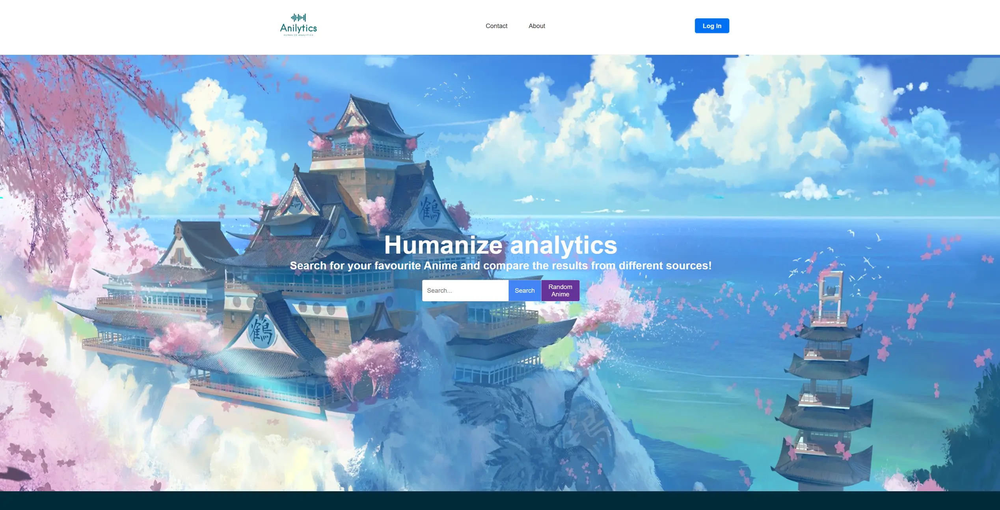
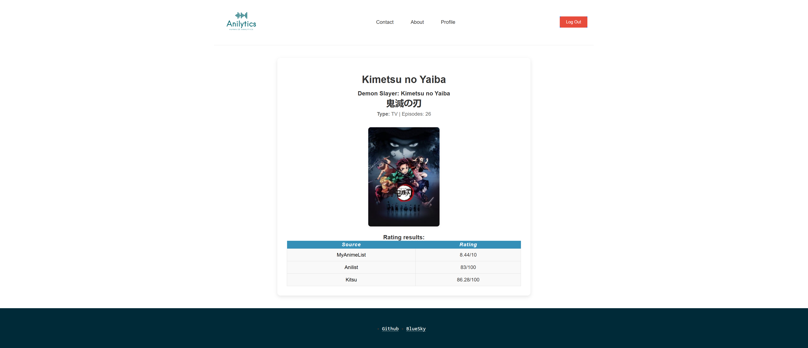

# Anilytics

Nowadays, when you want to check the rating of an anime, there are plenty of websites for that. Instead of visiting all those websites one by one, you can view everything on a single website.


---

## Table of Contents

- [Installation](#installation)
- [Usage](#usage)
- [Features](#features)
- [Screenshots](#screenshots)
- [Contact](#contact)

---

## Installation

Follow these steps to get the project up and running:

### Pre-requisites

Ensure you have the following installed:
- **[Node.js](https://nodejs.org/):** Version 22.11.0 or higher recommended.
- **[NPM](https://www.npmjs.com/):** For managing packages.

## Key Dependencies

This project relies on the following major libraries:

- **[React](https://reactjs.org/):** A JavaScript library for building dynamic user interfaces.
- **[React DOM](https://reactjs.org/docs/react-dom.html):** Provides methods for rendering React components into the DOM.
- **[Vite](https://vitejs.dev/):** A blazing-fast build tool and development server for modern web projects.
- **[React Router DOM](https://reactrouter.com/):** Enables seamless client-side routing and navigation between pages.
- **[Axios](https://axios-http.com/):** Facilitates HTTP requests, especially for RESTful APIs.
- **[React Modal](https://github.com/reactjs/react-modal):** A lightweight library for creating accessible modal dialogs.
- **[FontAwesome Free](https://fontawesome.com/):** Adds stunning icons to your UI, enriching user experience.

For a comprehensive list of dependencies, see the [`package.json`](./package.json) file.

### Clone the Repository

To clone this project, follow these steps:

1. Open your terminal or command prompt.
2. Navigate to the directory where you want to clone the project.
3. Choose one of the following methods to clone the repository:

#### Using HTTPS:
```bash
git clone https://github.com/I-Like-Sushi/Anilytics.git
```

#### Using SSH:
```bash
git clone git@github.com:I-Like-Sushi/Anilytics.git
```

4. Navigate into the cloned project directory:
```bash
cd Anilytics
```

## Usage
To run the project locally, execute the following commands:
```bash
npm install     # Install all dependencies
npm run dev     # Start the development server
```

Once the server starts, navigate to `http://localhost:5173/` in your browser to access the application.

### Example Screenshots



## Features
- Search for anime ratings across multiple platforms.
- View detailed anime statistics and analytics in one place.
- Interactive charts for visualizing anime popularity.
- Mobile-friendly and responsive design.

## Acknowledgements
- **[Jikan API](https://jikan.moe/)**, **[Anilist API](https://docs.anilist.co/)** and **[Kitsu API](https://kitsu.docs.apiary.io/)**:  For their anime data and ratings.
- **[React Modal](https://github.com/reactjs/react-modal):** For modal dialogs.
- Special thanks to all contributors and beta users for their feedback.

## Contact
Feel free to reach me through:
- Email: [Anilytics@outlook.com](mailto:Anilytics@outlook.com)
- GitHub: [I-Like-Sushi](https://github.com/I-Like-Sushi)